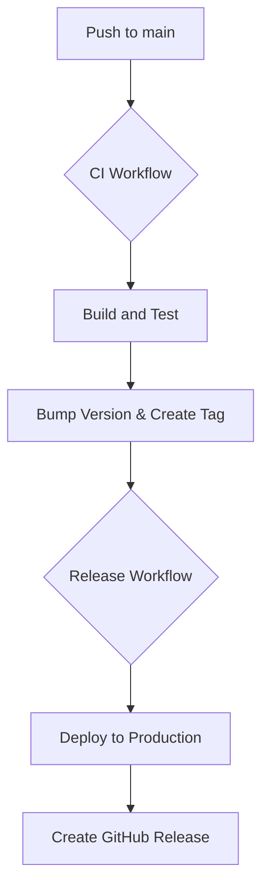

# GitHub Actions EC2 Pipeline

A simple Node.js application with a CI/CD pipeline using GitHub Actions to deploy to an EC2 instance.

This project is a demonstration of how to set up a full CI/CD pipeline for a Node.js application. It includes a simple Express application, a set of tests, and a GitHub Actions workflow that automatically builds, tests, and deploys the application to an AWS EC2 instance.

## Features

*   **Node.js Express Application:** A simple REST API with a few endpoints.
*   **CI/CD Pipeline:** A GitHub Actions workflow that automates the entire build, test, and deployment process.
*   **Zero-Downtime Deployment:** The deployment script uses `pm2 reload` to ensure that the application is always available, even during deployments.
*   **Rollback Mechanism:** The deployment script automatically creates a backup of the previous release. If a deployment fails, it automatically rolls back to the previous version.
*   **Automated Versioning and Releases:** The pipeline automatically bumps the version number, creates a tag, and generates a GitHub release.
*   **Health Checks:** The CI/CD pipeline includes a health check step to ensure that the application is running correctly after a deployment.
*   **Monitoring:** A separate GitHub Actions workflow runs every 5 minutes to check the health of the application and sends a notification if it's down.

## CI/CD Pipeline

The CI/CD pipeline is split into two workflows: `ci-cd.yml` for Continuous Integration and `release.yml` for Continuous Deployment.

### `ci-cd.yml` - Continuous Integration

This workflow runs on every push to the `main`, `development`, and `feature/*` branches. It consists of two jobs:

1.  **`build-and-test`:** This job builds the application and runs the test suite.
2.  **`bump-version`:** This job runs only on the `main` branch after the `build-and-test` job succeeds. It automatically bumps the patch version of the application and creates a new Git tag (e.g., `v1.0.1`).

### `release.yml` - Continuous Deployment

This workflow is triggered whenever a new tag is pushed to the repository. It consists of two jobs:

1.  **`deploy`:** This job deploys the application to the production EC2 instance. It uses the `deploy.sh` script to perform a zero-downtime deployment.
2.  **`create-release`:** This job runs after the `deploy` job succeeds. It creates a new GitHub Release with the corresponding tag.

### Deployment Diagram



## Technologies Used

*   **Node.js**
*   **Express**
*   **Jest** for testing
*   **GitHub Actions** for CI/CD
*   **AWS EC2** for hosting
*   **PM2** for process management
*   **Bootstrap** for the frontend

## Local Setup

1.  Clone the repository:

    ```bash
    git clone https://github.com/daretechie/github-actions-ec2-pipeline.git
    ```

2.  Install the dependencies:

    ```bash
    npm install
    ```

3.  Start the application:

    ```bash
    npm start
    ```

4.  The application will be available at `http://localhost:3000`.

## Configuration

The CI/CD pipeline requires the following secrets to be set in the GitHub repository:

*   `PROD_EC2_HOST`: The hostname or IP address of the production EC2 instance.
*   `PROD_EC2_USER`: The username for the production EC2 instance.
*   `PROD_EC2_KEY`: The private SSH key for the production EC2 instance.
*   `DEV_EC2_HOST`: The hostname or IP address of the development EC2 instance.
*   `DEV_EC2_USER`: The username for the development EC2 instance.
*   `DEV_EC2_KEY`: The private SSH key for the development EC2 instance.